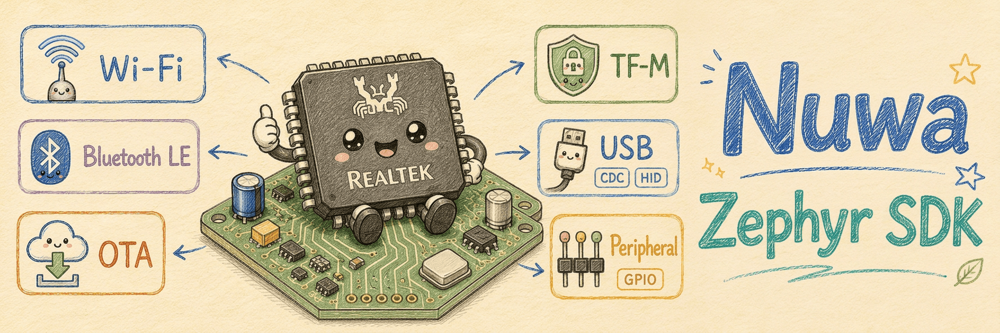

<div align="center">



# Nuwa — Ameba Zephyr SDK

**基于 [Zephyr RTOS](https://zephyrproject.org/) 的 Realtek Ameba 系列芯片官方 IoT 开发框架。**

[](https://zephyrproject.org/)
[](https://github.com/Ameba-AIoT/nuwa/search?l=c)
[](LICENSE)
[](https://github.com/Ameba-AIoT/nuwa/commits/main)

[English](README.md) · [中文版](README_CN.md) · [文档 / Docs](https://aiot.realmcu.com/zh/latest/zephyr/) · [产品页](https://aiot.realmcu.com/zh/solution/zephyr.html)

</div>

Nuwa 是 Realtek Ameba 系列 SoC 基于 Zephyr RTOS 的官方 IoT 开发框架。它以 [west](https://docs.zephyrproject.org/latest/develop/west/index.html) 作为多仓库管理工具，本仓库即为 **west manifest 仓库**，负责追踪所有子仓库的提交版本。

## 🔌 支持的芯片

| 芯片       | Zephyr 支持状态 |
|:---------- |:--------------:|
| RTL8721F   | ✅ 已支持       |
| RTL8721Dx  | ✅ 已支持       |
| RTL8730E   | ✅ 已支持       |

完整的芯片与驱动支持矩阵请访问 [Ameba Zephyr Solutions](https://aiot.realmcu.com/zh/solution/zephyr.html)。

## 📥 开始使用

SDK 采用 `west` 管理的多仓库结构。[Zephyr SDK 文档](https://aiot.realmcu.com/zh/latest/zephyr/)涵盖环境搭建、编译系统、外设驱动、Wi-Fi、OTA、TF-M 等完整内容。

### 快速开始

```bash
# 1. 创建并激活 Python 虚拟环境
python3 -m venv ~/nuwa/.venv
source ~/nuwa/.venv/bin/activate

# 2. 安装 west
pip install west

# 3. 获取 SDK
cd ~/nuwa
west init -m https://github.com/Ameba-AIoT/nuwa.git
west update

# 4. 创建 nuwa.py 快捷方式
ln -sf tools/meta_tools/nuwa.py nuwa.py
```

## 🏗️ 编译

```bash
./nuwa.py build -b <BOARD> <SOURCE_DIR>

# 例如
./nuwa.py build -b rtl872xda_evb zephyr/samples/hello_world
```

更新所有仓库到最新版本：

```bash
./nuwa.py update
```

其他命令：

```bash
west build -t clean      # 部分清理（保留配置文件）
west build -t pristine   # 完全清理
west build -t menuconfig # 打开 Kconfig 图形配置界面
```

## ⚡ 烧录

**Windows 主机** — 通过串口线连接开发板后执行：

```bash
./nuwa.py flash --port <PORT>
```

**Linux 主机** — 在与开发板相连的 Windows 电脑上下载并启动 [AmebaRemoteService](https://aiot.realmcu.com/download/misc/AmebaRemoteService_v2.0.2.exe)，然后在 Linux 主机上执行：

```bash
./nuwa.py flash --port <PORT> --remote-server <WINDOWS_IP>
```

## 🖥️ 串口监视器

**Windows 主机** — 通过串口线连接开发板后执行：

```bash
./nuwa.py monitor --port <PORT> -b 1500000 [--reset]
```

**Linux 主机** — 在与开发板相连的 Windows 电脑上启动 [AmebaRemoteService](https://aiot.realmcu.com/download/misc/AmebaRemoteService_v2.0.2.exe) 后，在 Linux 主机上执行：

```bash
./nuwa.py monitor --port <PORT> -b 1500000 --remote-server <WINDOWS_IP> [--reset]
```

`--reset`：monitor 启动时自动重启开发板。

## 💬 反馈

- **问题 / 建议**：登录 [RealMCU](https://www.realmcu.com/en/Account/Login) 提交反馈。
- **代码问题**：直接在 GitHub 发起 Pull Request 或 Issue。
